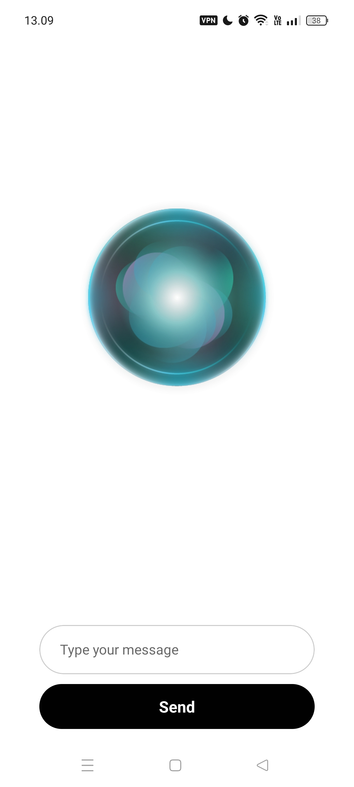

# Building Interactive Conversational Apps with AI and Text-to-Speech in React Native

## Deskripsi
Aplikasi ini adalah antarmuka percakapan interaktif berbasis React Native yang memungkinkan pengguna untuk mengirimkan pesan ke model AI (menggunakan Hugging Face API) dan mendengarkan respons dalam bentuk suara menggunakan `expo-speech`. Selama proses, sebuah animasi Lottie akan dimainkan untuk meningkatkan pengalaman pengguna. Aplikasi ini juga mengelola clipboard dan memberikan respons suara dengan lancar.

## Tampilan Utama

### Fitur Utama:
- **Input Pesan Teks**: Pengguna dapat mengetik pesan dan mengirimnya.
- **Animasi Interaktif**: Lottie animation yang berfungsi sebagai indikator visual selama proses pengambilan respons dan pemutaran suara.
- **Suarakan Respons**: Respons AI dibaca menggunakan `expo-speech`.
- **Clipboard**: Clipboard dibersihkan setelah pengiriman pesan untuk menjaga kebersihan data.
- **Desain Responsif**: Desain UI yang dapat menyesuaikan dengan berbagai ukuran layar perangkat.

---

## Instalasi

🔧 **Clone Repositori**:  
Clone repositori ini ke mesin lokal Anda.
```bash
git clone https://github.com/dioarafll/speakAIFlow.git
cd speakAIFlow
```

🛠️ **Install Dependencies**:  
Install semua dependensi menggunakan npm atau yarn.
```bash
npm install
```

🚀 **Jalankan Aplikasi**:  
Untuk menjalankan aplikasi di emulator atau perangkat fisik:
```bash
npm start
```

---

## Konfigurasi API

🔑 **Hugging Face API**:  
Aplikasi ini menggunakan API dari Hugging Face untuk menghasilkan respons berbasis teks. Anda harus memiliki API key untuk mengakses model AI yang relevan.

**Cara Mendapatkan API Key**:
- Daftar di [Hugging Face](https://huggingface.co/) dan dapatkan API key.
- Ganti `hf_xrYkvHgWTcwPyqnPGSxOoWFJKJSoyYuLT` dengan key API Anda di dalam kode.

---

## Penggunaan

💬 **Masukkan Pesan**:  
Ketik pesan Anda di kolom input.

📤 **Kirim Pesan**:  
Tekan tombol **Send** untuk mengirim pesan dan menerima respons dari model AI.

🎶 **Visualisasi & Suara**:
- Lottie animation akan diputar saat respons AI sedang diproses.
- Setelah respons diterima, suara akan dibacakan menggunakan fitur text-to-speech dari `expo-speech`.

📋 **Clipboard Handling**:  
Clipboard aplikasi akan dibersihkan setelah setiap pengiriman pesan.

---

## Saran Pengembangan Lebih Lanjut

### 1. **Integrasi Google Speech API**:
📢 **Tantangan**: Saat ini, aplikasi menggunakan `expo-speech` untuk text-to-speech. Sementara itu, **Google Speech API** memiliki fitur yang lebih maju dan dapat memberikan suara yang lebih natural serta berbagai pilihan suara (misalnya, memilih gender suara).

**Langkah-langkah Integrasi**:
- Daftar di [Google Cloud](https://cloud.google.com/speech-to-text).
- Ikuti dokumentasi untuk mendapatkan API key Google Speech-to-Text.
- Integrasikan API Google Speech untuk menghasilkan suara dari teks.

**Manfaat**:
- Variasi suara (gender, aksen, kecepatan berbicara).
- Kemampuan analisis suara yang lebih canggih, seperti menangani noise atau kualitas suara yang lebih alami.

### 2. **Visualisasi Audio**:
🎧 **Tantangan**: Menambahkan visualisasi dari audio yang diputar bisa menambah elemen interaktif dalam aplikasi ini.

**Langkah-langkah Pengembangan**:
- Gunakan pustaka seperti [react-native-audio-visualizer](https://github.com/danilowoz/react-native-audio-visualizer) untuk menganalisis dan menampilkan grafik audio.
- Integrasikan visualisasi berbasis gelombang suara atau spektrum audio yang bergerak sesuai dengan audio yang diputar.

**Manfaat**:
- Meningkatkan pengalaman pengguna dengan visualisasi yang dinamis.
- Memberikan umpan balik visual tentang suara yang sedang diputar, membuat aplikasi lebih interaktif.

### 3. **Penggunaan Mode Offline**:
🌐 **Tantangan**: Aplikasi ini bergantung pada koneksi internet untuk berinteraksi dengan Hugging Face API. Penggunaan model AI secara offline bisa menjadi fitur tambahan.

**Langkah-langkah Pengembangan**:
- Pertimbangkan untuk menggunakan model AI yang dapat dijalankan secara lokal, seperti [TensorFlow Lite](https://www.tensorflow.org/lite) atau model-model AI lain yang mendukung eksekusi offline.

**Manfaat**:
- Pengalaman pengguna yang lebih cepat tanpa bergantung pada koneksi internet.
- Privasi yang lebih baik, karena data tidak perlu dikirim ke server eksternal.

---

## Struktur Direktori

```
/speakAIFlow
|-- /src
|   |-- /components
|   |-- /screens
|   |-- /services
|-- /assets
|-- App.js
|-- package.json
```

- `/components`: Komponen UI seperti input, tombol, dan animasi Lottie.
- `/screens`: Tampilan layar utama dan fitur utama aplikasi.
- `/services`: Layanan untuk API Hugging Face dan pengaturan audio.

---

## Lisensi

📝 MIT License. Lihat [LICENSE](./LICENSE) untuk informasi lebih lanjut.

---

## Penutupan

🎉 Aplikasi ini menunjukkan integrasi AI dengan suara dalam pengalaman pengguna yang interaktif. Dengan pengembangan lebih lanjut, aplikasi ini dapat menjadi platform percakapan yang lebih kuat dengan pengenalan suara dan visualisasi audio yang lebih canggih.

